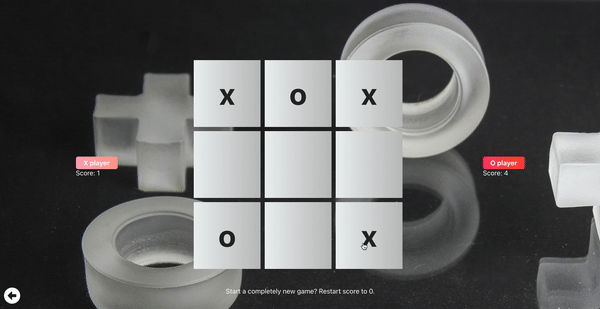
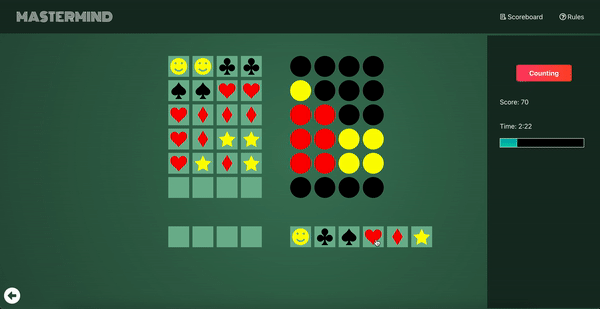

# Mini games

> Contains two mini games written in ReactJS ➡️ Tic Tac Toe and Mastermind.

## How it is built?

- ReactJS (incl. React hooks);
- Testing with Jest and React Testing Library;
- Firebase for keeping score.

## Usage

### 1. Tic Tac Toe ❌⭕❌

- Classic logic game with X and O in a 3×3 grid;
- Local multiplayer game (i.e 2 players on single desktop/mobile);
- Track scores of both players.

### 2. Mastermind ♠️♥️♣️♦️

- Challenging game of logic and deduction (and little bit of luck!) for a single player;
- Redesign of classic Mastermind game:
  - Goal of game is to guess secret combination of 4 signs (out of 6 possible) in 6 rows or less;
  - After each row, the game gives clues to the player - red if sign is guessed and on right place and yellow if sign is guessed but not on right place.
  - Guessing the whole combination for each row brings certain points (e.g. guessing in first row brings 60 points, in second 50 points, etc., while fail leads to -10 points);
  - To make it more difficult - player has limited time of 3 minutes to win the highest score;
- Score of all players is tracked in score-list (kept in Firebase).

Enjoy! 🚀 🚀 🚀
